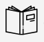
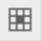

Announcement

Student Introductory Assignment (SIA)

  <blockquote>
    

      
Insert paragraph

      The City University of Seattle requires that you submit a Student Introductory Assignment (SIA). This SIA must be completed during the first week of your course. The SIA consists of introducing yourself in the Discussion Forum titled: Student Introductory Assignment. It is designed to begin the online class experience by letting us know a little more about you and showing that you are participating in class. It is due at the end of the first week. Your instructor will notify City University at the end of <b>the first week</b> as to whether or not you completed your SIA.
        
      For students receiving financial aid, the timely submission of the SIA will be used to fulfill financial aid reporting obligations. If you have any questions or concerns about financial aid requirements, please contact the Financial Aid Office at 800.426.5596.
    

  </blockquote>

Course Content

Module 1 - Software Security and the Software Development Lifecycle

  
  <ul>Creating <b>Introduction to Textbook</b> Section
    <li>Go to Module 1</li>
    <li><i>Build Content</i> > <i>Item</i></li>
    <li>

        
Insert this text

        This textbook is heavily text based with little to no interactive elements. That means that you’re going to need to take the initiative in really understanding what you read. We’ll be giving you some strategies as we go along that can help you increase your comprehension. We will be heavily using this book in this course.  
      

    </li>
    <li>Insert image 🌄</li>
    <li>

        
Insert this text

        The textbook relies heavily on the reader’s knowledge of the software development lifecycle. If you are not familiar with the SDLC or you need a refresher, you will want to read this article on SDLC.  
      

    </li>
  </ul>

  <ul>Creating <b>Required Reading</b> Section
    <li>Go to Module 1</li>
    <li><i>Build Content</i> > <i>Item</i></li>
    <li>

        
Insert this text

        Read Chapter 1 of Ransome & Misra. The first chapter is an introduction to the topic of the software security field. Similar to the presentation video, it introduces what we’ll be learning throughout the rest of the course. One major takeaway from this chapter is the concept that the sooner security defects are identified in the process of developing software, the less costly it will be to remediate the defects. Further, defects that are identified later in the software development process are costlier to remediate. 
      

    </li>
    <li>

        
Insert this icon, text and hyperlink

         Sitaram, D. & Manjunath, G. (2011). Moving to the cloud: developing apps in the new world of cloud computing.
      

    </li>
  </ul>

  <ul>Creating <b>Research: Citing your Sources (LIB2)</b> Section
    <li>Go to Module 1</li>
    <li><i>Build Content</i> > <i>Item</i></li>
    <li>Right-click on textarea then click <i>Insert/Edit Table</i></li>
    <li>click <i>Table Cell Properties</i> </li>
    <li>Set the first cell to <b>width</b> <i>250(px)</i></li>
    <li>In left column: Insert image 🌄</li>
    <li>
      <blockquote>
        

          
In right column: Insert paragraph

          <a href="https://library.cityu.edu/howto/apa-writing/use-apa-style/">How-To Use APA Style</a>
           
          This guide contains a list of basic APA style elements. Please review this document to familiarize yourself with using APA style.  
            
          You need to cite your sources in order to identify other people’s ideas and information used within your assignments. If you take or copy someone else’s words or ideas and present them as if they were your own, you are plagiarizing. Any information that is not “common knowledge” must be cited. Common knowledge is information that most people know without looking it up. Common examples are “the sky is blue” or “it rains a lot in Seattle.” If you’re not sure whether something is common knowledge, citing it is better than not citing it.   

      </blockquote>
    </li>  

  </ul>

  <ul>Creating <b>Next Module</b> Section
    <li>Go to Module 1</li>
    <li><i>Build Content</i> > <i>Course Link</i></li>
    <li><i>Browse</i> <b>Module 2</b></li>
    <li>Name: <b>Next Module</b></li>
    <li><i>Submit</i></li>
  </ul>

# Assignments

- Muddiest Point
  - Essay 4 credits
  - Multiple Choice 1 credit

## Create Essay Question:

Title:
The Muddiest Point

Question:

After reading the required reading,  select only one key topic that you could not understand clearly. 
If not, find the most interesting topic.
And then, briefly describe the muddiest point or the most interesting point.

Your instructor will visit the collected topics and explain in class.

Answer:

## Multiple Choice:
Title:

Question 1

Question:

Question?

Answer:

A

B

C

D

