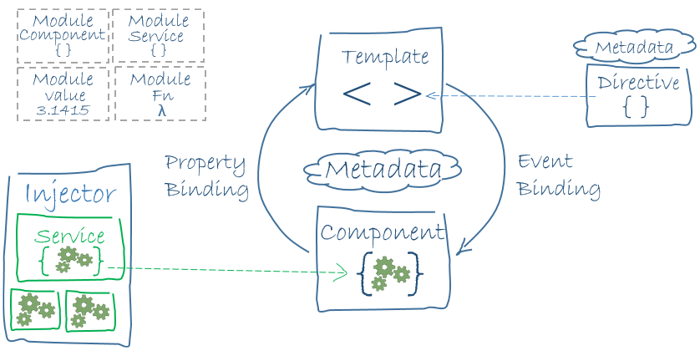

# Angular Architecture
## Angular
- platform and framework for building apps in HTML and TypeScript.
- written in TypeScript.
- _NgModules_ is the basic building blocks for an Angular app.
- App has at least a _root module_ that enables bootstrapping.
- Also has _feature modules_
  - Components
    - _views_ 
      - sets of screen elements.
    - _services_ 
      - provide functionality not directly related to _views_.
      - service provider can be _injected_ into components as _dependencies_, making your code modular, reusable and efficient.
    - components and services are classes with _decorators_ marking their type and provide metadata on how Angular would use them.
      - metadata for component class associates it with a _template_ that defines a view. Combines HTML with Angular _directives_ and _binding markup_ that allow Angular to modify the HTML before rendering it for display.
      - metada data for service class provides information Angular needs to make it available to components through _dependency injection (DI)_.
    - `Router` service helps define navigation paths among views.

## Modules
- differs but complements JavaScript (ES2015) modules.
- every Angular app has a _root module_, named _AppModule_.
- App typically contains many functional modules.
- Like JavaScript modules, NgModules can import functionality from other NgModules, allows their functionality to be exported and used by other NgModules.
- For example, import `Router` NgModule to have router service in your app.
- _lazy-loading_ technique lets you load modules on demand to minimize amount of code that needs to be loaded at startup.

## Components
- Every Angular app has at least one component, _root component_, that connects a component hierarchy with page DOM.
- Each component defines a class that contains application data and logic, and is associated with an HTML _template_ that defines a view to be displayed in a target environment.
- `@Component()` decorator identifies class immediately below it.
- Decorators are functions that modify JavaScript classes. Angular defines a number of decorators that attach specific kinds of metadata to classes.

### Templates, directives, and data binding
- Template combines HTML with Angular markup that can modify HTML elements before they are displayed. Template _directives_ provide program logic, and _binding markup_ connects your application data and the DOM.
- Two types of data binding:
  - _Event binding_ 
    - lets apps respond to user input in the target environment by updating your application data.
  - _Property binding_
    - lets you interpolate values that are computed from your application data into HTML.

- Before view is displayed, Angular evaluates directives and resolves the binding syntax to modify the HTML elements and the DOM.
- templates can use _pipes_ to improve user experience. by transforming values for display.

## Services and dependency injection
- create a _service_ class if data or logic that is not associated with a specific view.
- service class deinition is preceeded by `@Injectable()` decorator.

## Routing
- Angular 'Router' NgModule provides a service that lets you define a navigation path among the different application states and view hierarchies in your app. It is modeled on the familiar browser navigation conventions:
  - Enter a URL in the address bar and the browser navigates to a corresponding page.
  - Click links on the page and the browser navigates to a new page.
  - Click the browser's back and forward buttons and the browser navigates backward and forward through the history of pages you've seen.

